## TL;DR

**What is the ECC Method?** A systematic framework designed specifically for cross-functional leaders who must unite people they don't manage, across departments they don't control, on topics that aren't anyone's primary job. Unlike traditional frameworks built for single teams, ECC uses modular "reading grids" that adapt to any organizational context while maintaining proven effectiveness.

**Why it matters:** 75% of cross-functional initiatives fail, yet 89% of companies depend on them. The ECC Method bridges this gap with field-tested tools that have helped 100+ leaders increase community engagement, transform passive members into active contributors, and establish new company standards—all while saving time and resources.

**Core principle:** Engineer collective systems that work, don't just manage people harder.

# The Cross-Functional Leadership Crisis: Why Traditional Frameworks Fail

We've been hearing a lot about VUCA in recent years (Volatile, Uncertain, Complex, Ambiguous) because of the speed of information exchange. It's not VUCA anymore: it's VUCA on steroids! The world is changing at exponential speed, and organizations everywhere are shaken in their responses.

Every year, major changes hit all organizations, big and small. Technological disruptions (Remote work, Cybersecurity, AI, soon Quantum computing, Robotics, Electric Vehicles...), political upheavals (too many to mention), regulatory shifts (GDPR, AI Act...), and cultural transformations (DEI initiatives...) arrive faster than organizations can absorb them.

Can all of these organizations restructure at the speed of these changes? Absolutely not!

Here's the reality: companies must adapt and evolve, but they cannot constantly reorganize. They cannot rely too heavily on external dependencies. They cannot multiply management layers and increase the manager-to-worker ratio without breaking their operational efficiency.

**So how are organizations responding to this acceleration?**

The obvious answer happening EVERYWHERE? **Transversal Leaders**, also called Cross-functional Leaders. These professionals must lead their colleagues without having authority over them, because they work across different departments and teams while tackling the same strategic topics.

**The core challenge remains the same across all contexts: how do you engineer collective systems that work, rather than just managing people harder?**

Transformation director coordinating company-wide change? Cross-functional leader. Head of Innovation working with all business units? Cross-functional leader. Network coordinator managing trainers across divisions? Cross-functional leader. New ways of working program manager? Cross-functional leader again! Platform adoption manager deploying AI tools company-wide? Yet another cross-functional leader.

The numbers tell the story: **According to McKinsey, 75% of cross-functional initiatives fail to meet their objectives**. Meanwhile, **Gartner reports that 89% of companies now rely on cross-functional teams for critical business outcomes**. The paradox is clear: we desperately need these leaders to succeed, yet most are set up to fail.

**But why is cross-functional leadership so challenging?**

Because not everyone can be a CEO or C-level executive, yet many need to engage and mobilize colleagues across the entire organization on specific topics. And here's the catch: these colleagues have OTHER priorities—namely, their actual jobs.

The challenges multiply exponentially. Getting people to work on "transversal topics" often isn't counted in their operating budgets, so it requires pure goodwill. As a cross-functional leader, you don't have access to their time as if you were their direct manager.

You need high-level sponsors, but how do you navigate to sponsors across multiple departments when you need people from everywhere? How do you operate with distributed groups who don't belong to the same team, may not use the same tools, work in different time zones, and come from different organizational cultures?

It's challenging enough to make actual teams work together—but how do you make "distributed collectives" function effectively?

Quoting a customer
`"The challenge was significant: how to motivate each group of about twenty engineers to dedicate part of their time to something other than building their product, which they do daily and for which deadlines are set. How to motivate engineers to engage in a continuous learning process. It was in this context that the ECC Method began to help us, first by seeking to understand our learning challenges, then by proposing and guiding us in laying the foundations for a regular collective practice. We then discovered how to transform an initiative of a few (the skill referents) into a collective approach, where each team member becomes active, proposing content, seeking peer feedback, and above all, embracing a personal sustainable learning approach."`


**And there's more complexity ahead.**

You yourself may be part-time on these cross-functional tasks. How do you motivate people you don't see every day? How do you identify who to engage first, second, or at all within the company? How do you coordinate with other scattered cross-functional initiatives that compete for the same goodwill and discretionary time?

How do you overcome responses like "we don't do it like that here" or combat "not invented here" syndrome and entrenched silo mentalities?

**The market gap is glaring.**

These challenges are numerous, more professionals face these situations daily, yet there are surprisingly few solutions designed specifically for this growing population of cross-functional leaders.

Here's what changes when you work with cross-functional leaders: you can't target a specific department. I remember an entrepreneur asking me, "Who's your persona? Which department do they work in? IT? HR? Communications? Marketing?"

I couldn't answer because being cross-functional is a _property_ and represents a specific set of challenges, not something tied to a particular trade or department. I cannot leverage "strong IT culture," "strong HR practices," or "established marketing tools" to address these problems—the solutions must transcend departmental boundaries.

**Yet these leaders are everywhere, creating friction throughout organizations.**

This friction slows decisions, delays projects, wastes money and time, burns out talented people, and creates inefficiencies. But it's inevitable because enterprise-wide changes are necessary, even though companies cannot reorganize every time news breaks.

**My breakthrough came from looking at the problem differently.**

When launching my company to help these leaders—and I've now supported hundreds of them—I had to develop a fundamentally different approach.

I was already well-versed in agile frameworks, Design Thinking, Lean Startup methodologies, and similar approaches. Some could be applied to cross-functional leaders, but never directly. They always required significant adaptation efforts, yet still failed to address the full spectrum of challenges I've outlined above.

Why? Because these frameworks weren't designed for this context! Agile frameworks were created for product development teams, not for HR transformation initiatives with their unique constraints and specificities. Design Thinking? The name speaks for itself. Lean Startup? Nice principles, but not every context is a startup context with all the venture mentalities everywhere. 

**But how do you address this WIDE variety of contexts?**

Cross-functional leaders emerge from every department and operate at every organizational level—from beginner operatives to experienced senior managers to C-level executives. Each brings different constraints, cultures, and capabilities.

**The answer: engineer collective systems that work, rather than just managing people harder.**

The approach I developed draws from my engineering and organizational coaching background. You don't build the exact same bridge twice in the world, but bridge construction principles can be identified, understood, and adapted to each unique situation.

The same applies to building bridges between people.

```Quote from a customer
"The ECC Method brought a structured and methodical approach to help our teams and communities improve their organization, particularly in environments where roles and responsibilities are transversal and complex. Through in-depth analysis and tailored content, it designed a precise and adaptable diagnostic framework, enabling us to identify key areas for improvement in each specific situation. This work has been a real asset in clarifying responsibilities, streamlining collaboration, and enhancing overall efficiency."
```


**This was my breakthrough moment:** All cross-functional leaders share something fundamental—they must engineer collectives within their companies. Call them communities, ambassador networks, alliances, task forces, or working groups. What matters is that they are cross-functional, and the people involved are primarily focused on other jobs.

This insight became our foundation. 

**"The results speak for themselves:"**
- Community leaders who **tripled membership in 6 months**
- Heads of discipline who transformed **30 people from consumers to contributors** while dramatically increasing autonomy and engagement
- Stream leaders who turned peer networks into **recognized forces across 7 business divisions**, increasing negotiating power company-wide
- Engineers who engaged communities to create **local standards** that became company-wide references
- Network coordinators who established **complete operating models in just 3 sessions** over 3 months
- Platform deployment leaders who **balanced governance across multiple departments** without work overload
- Software engineering leaders who **aligned workgroups on common strategies** across business units
- **100+ leaders** saving time, budget, and goodwill while increasing recognition and internal mobility opportunities


```Quotes from my customers
> _"It's both incredibly inspiring and immediately actionable (I successfully applied the methods with remarkable results). The mindset and results-focused approach make this method a guaranteed recipe for success. I would recommend it without hesitation."_

> _"The ability to take a step back on key issues and to propose tools tailored to my community's maturity and specific needs was a real differentiator. Thanks to this advice and support, I was able to effectively structure and grow the community. The ECC Method is a committed, attentive, and pragmatic approach that brings genuine added value to community management and facilitation. Any organization looking to energize its communities can confidently rely on this know-how."_
```


We began building, brick by brick, what would become the **Engineering Corporate Collectives Method**— a systematic approach designed specifically for the unique challenges of cross-functional leadership in our exponentially changing world—because the solution isn't managing people harder, it's engineering collective systems that actually work.


# 1. What is the ECC Method ? 

The ECC Method is a problem-solving question-based framework, equipped with reading grids, ready-to-use workshops, AI agent architectures, conditional recommendations, designed to tackle the challenges of transversality in large companies.

## 1.1 Specific scope of the ECC Method

The ECC Method is focused on a very specific type of corporate collectives: collectives that involve people under different authorities (usually working in different parts of a same organization, or even in different organizations). 

Anyone understanding interconnectivity of topics, in our current fast-changing world, could easily estimate that transversal or cross-functional questions will multiply, that large organizations will most likely always require initiatives to run across departments, silos, and other inner splits as entities. 

We also believe that organizations like companies can also change their inner structure by using cross-functional inner organizations that first are built to answer a given problem (*for example a taskforce to solve a risky situation*), then can evolve into a cross-functional long term project (*for example, securing conditions so that the risky situation does not happen again*), or even a long term cross-function department (*for example, a department dedicated to cover topics of a certain field, possibly related to initial situation*), which in turn can shape the future changes of the organization (*for example, other departments build on different scope but same logic*). 

In mathematical and computational terms, if an organization (like a company) could be described like a mathematical function, its cross-functional or transversal departments could be key elements to describe the derivative of the function. 

Cross-functional or transversal initiatives are a way to represent change happening to organizations.

The Engineering Corporate Collectives (ECC) Method helps transversal leaders, and their team members break free from operational overload and stress, unlock the full potential of transversal initiatives, secure buy-in from sponsors and stakeholders, and achieve greater visibility and impactful results within their organization.

The ECC Method has a structured and on-field proven approach that empowers leaders to:

•**Strengthen cross-functional leadership capabilities**: Transition from reactive, day-to-day management to proactive, systemic leadership by focusing on the right questions.

•**Navigate complexity with confidence**: Master the unique challenges of transversal dynamics and translate current understanding into actionable vision, strategy, and decisions.

•**Elevate collective performance**: Equip transversal collectives with the right tools, workshops, and systems at the right time to foster autonomy, alignment, and high performance.

## 1.2 Why do we need engineering of collectives and not just personal or interpersonal skills ?

The ECC Method aims to deal with classes of situations and problems with either high number of people, high complexity, or both, for which individual skills and interpersonal skills alone are not enough, even though necessary.

When leaders are faced with situations that require system design, an engineering and system thinking approach can complete individual and interpersonal skills.

The Engineering Corporate Collective method proposes a systemic engineering approach to manage these types of challenges and below.

## 1.3 Goals of the ECC Method for builders of collectives 

ECC method is not just only about doing what you love, finding what brings value to both organization and the individuals or fulfills a goal.  

It also focuses on engineering collective systems that can support the positive impacts described above while :
1. Finding ways that you can sustain activities as a leader (not over-relying on your goodwill, patience, personal time and resources that are not always scalable)
2. Minimizing efforts, waste, redundancy
3. Considering the set of values of people involved
4. Being compatible with the constraints and limitations of your organizations
5. Being interpretable, explainable, understandable
6. Building capabilities for yourself

## 1.4 Who is the ECC Method originally for ? 

This diagnosis aims to help people who are in charge of corporate collectives, especially when these collectives involve collaboration or at least cooperation from various entities. 

- Program Managers
- Project Manager
- Head of (transversal) departments, teams
- Head of disciplines, Engineering Manager
- Internal community leaders
- Internal Network leaders 
- Taskforce leaders
- …

# 2. How does the ECC Method works ? 

## 2.1 Starting point: Various approaches to tackle business complexity

### 2.1.1. The complexity of business problems

Business situations could be considered complex by nature. 
Any element of a given situation can be considered for inquiry towards further details (fractal like). 
Any detail can be considered a starting point, any starting point can become an angle through which the whole situation is considered (multi-facet). 
Applying the somehow very particular angle to analysis of all the situational elements and details create an explosion of potential (cognitive, operational, even emotional) workload. Some organizations sometimes seem caught in this maelstrom of mess.

*For example: let's imagine a "simple" business situation when 3 persons of a same company, doing the same job, let's say line manager, in different departments. These 3 persons have to define a common guide of practices of line managers. 
Manager A breaks down his job in 10 different main tasks, T1 "maintain good relationships with team members", T2 "Ensure most important work is documented", etc..  These tasks are considered  are all dependent on each other for an overall success. Each task is a detail.
Manager A can consider that all tasks should be done in a way to ensure the success of T1, beucase "good relationships are the base of any effective teamwork" according to him. That's a starting point.
All other situations and tasks of Manager B and Manager C could be analyzed through the lens of their impact on the quality of relationships within the team. That's an angle of view.
All updates of practices of Manager A, B, and C could be updated regarding the angle of view. That's a potential workload.
If we perform the same exercise on managers A, B, and C, even setting aside questions of arbitration, conflict management, etc, then the potential workload explodes.* 

Just organizing communities of practice and sharing moments, which would help people share practices in their job, even if useful (and extremely useful in many cases), cannot address the sheer complexity of business situations.  
Even with AI as a global help to go through all of these angles, just the work of data collection for AI to understand the context well makes the potential workload, and the cost of choice, huge.

### 2.1.2 Static framework approach at the rescue of business complexity

*"They will behave **this** way. They will take **this** role and follow **these** rules. So every stakeholder knows and can make more moves from this starting point. Larger decisions, recruitment, replacement, product delivery schedules, presentation : everything is made easy by static framework."*

Therefore, given the complexity of business situations, the stakes at hand, problem-solvers must
find ways to reduce cognitive workload of decision. 

One path is to use static frameworks that are extracted from industry experts in people's organization. 

Static frameworks are defined by rigid rules, made to be easily followed, facilitate decision making, learning, framework deployment workforce mobility and scalability.
There are advantages to a a one-size fits all operating and governance model.
Rules can apply on team size, duration of cycles, roles, workflows, representation of ideas, of workload etc.

Examples of static framework are SCRUM, SAFE, etc.

Static frameworks are defined for a specific set or range of starting conditions (culture, governance, requirements, etc.) and are sometimes tried in a wider variety of work environments than contexts it was defined for. Using a static framework for contexts that do not match the starting conditions creates cost of adaptation. However, this cost of adaptation is often considered acceptable in comparison with the decisional cost and running cost of "building a contextual framework by oneself".

Static framework are the result of a strong endeavor to understand commonalities between a wide variety of business context, and arbitrate into one-size fits all calibration of recommendations, which would then be adapted on case-by-case basis.

Also, static frameworks, with static roles and behaviors, increase predictability of behavior of individuals, easing representational pressure from stakeholders. By knowing how the others behave, knowing which rule they follow, not leaving too much degrees of freedom, many operational, tactical or even strategic goals are easier to engage. It goes from planning a delivery to recruiting replacement, knowing how many people to look for and what people to look for. It increases workforce mobility by providing common ground-rules. Complexity is made easy.

Thanks to static frameworks, a huge cognitive workload can be saved when building organizational systems.
### 2.1.3 A story of implementation of a static framework

Here is a story where the implementation of a static framework goes wrong. It is not meant to be statistically or narratively representative of most cases, but rather describes a fail case to better understanding the systemic risks of such an approach.


Two persons in charge of business transformation or organizational improvement discuss their strategy and their plans for a given context. One is a static framework specialist (like SCRUM, Safe, etc.), which means this person knows rules, and the method "by the book", we'll call this person "**Framework specialist**". The other person is somehow the **client** of the framework specialist, who needs to make the organizational answer to the strategic challenge a reality. Additional comments are added in italic for better understanding of what happens.

**Framework specialist**: "As the book says: 
- Work should be organized in sprints, 
- Sprints should always be 2 weeks long, 
- Meetings should happen in a specific order, pacing, and with specific rules,
… NOW LET'S APPLY."

**Client**: "Crystal Clear, now let's start !"

*A few weeks pass, implementation is not as good as predicted, implementation faces resistance as rigid rules do not fit complexity of local situation. Authoritative industry-wide propositions holders are fighting versus defenders locally historically tested ways for working. Results are indeed not there because some rigid answers may not grasp the very contextual complexity.*

**Client:** "It does not work as predicted, we have context specificities."
**Framework specialist:** "Then let's adapt!"
**Client:** "But how do we adapt ?"
**Framework specialist:** "Let's test-and-learn, we fail until we succeed…"

*A few weeks pass again. Continuous improvement of framework through retrospectives face rigidity of guidelines and slowness of arbitration. In other words, if one team is unhappy with some structural elements of the static framework, framework specialists are not ready to change the whole planned system for the team, both because they have to verify if other teams are ok, and also because they do not really know how to adapt the framework given the problem. Various changes are tried, but people are enough with "randomly" adjusting rules. People start losing patience: while they were adapting to the framework, the day-to-day delivery went from late to very late. Goodwill is dropping. Overall trust in the framework initiative drops.*

**Client**: "Patience can be limited, teams will not try forever, some would not even try. We're in a stalemate"
**Framework specialist**: \*thinking* These clients and this context are too rigid, we'll never go very far with them. 


What can be seen in this story is the difficult part of static framework, which is the cost of adaptation of context specificities. The cost of adaptation can be high, and either paid upstream (with customization of major framework elements from the start) or downstream (with test and learn cycles for example). Not all contexts are ready to pay for this cost: sometimes iteration can take patience away, and the situation may hit a loop of complexity, operational friction, low motivation, inertia, leading to low engagement. Success can become an improbable scenario leading to resignation to corporate rules. This may top an existing sentiment of lacking freedom, for individuals who value this aspect of their job, especially if the framework is very prescriptive in terms of roles, behaviors, values, etc.

On the framework specialists side, the good and benevolent intention to change may turn into frustration, criticism of context and possible resignation to entrenched conditions. It may become a "grey success", in which implementation of the framework is neither abandoned nor really promoted, in which remaining strategies are very slow hope, quiet quitting or leaving for more potent contexts. 

This dark story (fortunately) does not often happens. Statistics on real on-field conditions may be difficult to get. Measurement of implementation success can be biased by conflicts of interests. No one has a strong interest in declaring adoption of a framework is a failure. 

As suggested by the impersonal stories and analysis of this context, such failure and such stories are not the cause of low-skilled or ill-intentioned individuals, good and bad sides, but rather a predictable systemic consequence of properties of a static framework (which again, have many advantages as described in previous sections). 
### 2.1.4 The wandering-coaching approach

*A coach and a client are discussing: 
Coach: "What's the challenge in your context ?"
Client: "We need to accelerate the operations and therefore my team needs to apply guidelines instead of crafting their own jobs"
Coach: "What would accelerating the operations mean to you ?"
Client: "Safer projections for end of the year results"
Coach: "How else could you make it safe ?"
Client: "I could also ask customers how we could improve our product for more sales"
Coach: "And who else could you else how to improve your product ?
Client: "I could also ask marketing, they do that all day"
Coach: "Why didn't you ask them earlier ?"
Client: "Previous relationships with marketing did not go well, but now the head of marketing is a new person
Coach: "Does this person share goals with you this time, without the difficult relationship history to block your collaboration ?"
Client: "Sure! He is expected to make the new product a market success"
Coach: "And what are you going to do then ?"
Client: "I'm going to propose a plan to the new head of marketing about the new product, I need the customers insights from him then I can help him.*

Another approach could be called the wandering-coaching approach. 
The base of the wandering-coaching approach is to get rid as much as possible from existing models or angles of views, and trust the questioning ability to explore a wider range possibilities. 

Exercises like "questions bursts" from MIT Professor Hal Gregersen (also author of the "The Innovator's DNA") are typical of this approach. Feeling free to explore the complexity a problem in a spontaneous way can lead to innovative angles of views that are not covered by static framework. 

Also, such active pedagogy approach encourages emergence of solutions by the clients themselves as questions come, and therefore ownership, subsequent engagement and .  

You can find items here: [Article about Question Burst](https://mitsloan.mit.edu/ideas-made-to-matter/heres-how-question-bursts-make-better-brainstorms)

This approach has similarities with how the coaching approach is designed, with way less prescription (than in static framework for example) or authority-based posture. 

The wandering-coaching approach requires openness both of coach and client, also ability for the client context stakeholder to trust whatever emerges from the wandering-coaching session. Otherwise, implementation of emerged solutions can face the wall of "necessary trust" to start with.

Such trust may rely on industry experience and expertise (not always guaranteed in this approach alone, without constraints on either coach or client), general existing authority of client (which may limit the range of application of such approach to only high-ranked people), informal trust and leadership (which also reduces the number of possible people), or extreme relevance of solutions emerged from the coaching session (which is not unlikely, but not guaranteed either). 

In summary, the wandering-coaching approach needs openness during reflection session AND, because of the very spontaneous and specific nature of the solution, additional trust from stakeholders at implementation of emerged solutions to initial problem.


### 2.1.5 The contextual neighbor story approach

*"How did other professionals in similar contexts handle the situation ? I want the same thing they had !"*

One other way of tackling a business problem can rely upon an assumption of "similarity of contexts" and on cognitive-workload-saving approach of "delegation of solution-testing to first players". 

In practice, it's possible to encounter occurence of such approach when a professional, when faced with a specific situation, asks about stories and techniques of his "neighbor" (= person with apparently similar conditions). A bank organizing a seminar will ask about how other banks organized their seminars. Even if the recipes are not formalized as industry wide, they will travel across the human graphs of providers reusing content, communities of practice members sharing feedbacks, and books from various research institutions.

The contextual neighbor approach is probably the way humans learn—even animals learn—by imitation. It mutualizes testing effort at the moment of transmission, and imitation is directly oriented towards action, while finer understanding does not directly lead to results but rather to additional cognitive workload.

However, assumptions of enough similarities of context between a given past story and a given situation are often overlooked. Being in the same industry does not always mean sharing the same culture. Having the same jobs and the same number of people does not always mean the organization would work the same way. 

In practice, the number of similar conditions for a human problem-solver to consider two contexts identical can be quite low and limited by mental representation, available time and estimated workload of adjusting to differences. 
Let's say that this number of conditions is 5 for an example situation. Let's imagine that some person P1 working in a given bank A wants to organize a seminar for 150 persons of his department, and hears about how a person P2 in a bank B has organized such seminar for 120 persons of her department. 

Person P1 would say: *"If we share 5 characteristics with the other context, then we can just use the same formula as P2 from bank B. And I can find these 5 characteristics: 
1. *Sector: We're a bank A, they're a bank (B)*
2. *Range of number: It's for more than 100 persons*
3. *Type of event: It's a seminar*
4. *Current need: It needs a recipe*
5. *Relationship between people: These 100+ persons are from the same department* 
*To me, it's enough to take more or less the same recipe, we'll make some minor adjustments*
".*  

If the other characteristics are not relevant to the design of a seminar, then taking a recipe may be relevant. But in the other cases, simply imitating can lead to failure. 
### 2.1.6 One-person-army approach

*"We recruited a Jack of all trades, master of all. We delegate the difficult tasks, and somehow the person finds its way, reach goals and even surprises us."*

The one-person-army approach is a way to absorb business complexity by leaving scope and responsibilities to a very potent person. This very potent person is often described by many as highly skilled in a wide variety of personal and interpersonal skills, with qualities going from charisma to high patience and endurance. 

Also, this approach promotes human development, creates inspiration from the one-person-army as a role model for people around him or her, and also attract similar talent to a given context. This can launch a "golden age of heroes" where very potent people work together, absorb the complexity with their very human skills, and establish a contextual expertise that can spread beyond context of birth. It's often a delight and deeply instructive to work with one-person armies, even if it can somehow become tiresome. 

However, such approach also comes with drawbacks, for example: 
- lack of transparency as a high amount of tacit information is stored in brain and bodies, not as a data.
- risks in terms of resilience, as one-person-armies can fall sick, become unavailable for personal reasons, or can be attracted to other contexts, taking their valuable know-hows with them.
- risks due to lack of transparency as many informal processes lack sensors for fault, risk or threat detection.
- difficult scalability, as one-person-armies are difficult to replicate
- difficult system longevity, as one-person armies fall under the fate of biological aging, boredom (lack of challenges), and still run slower than the pace at which the world evolves.
- difficult change of processes and installation of new paradigms, as one-person-armies often get emotionally involved in what they build, increasing the cost of letting go.
- difficult to start, as one-person armies are both rare and useful, therefore often expensive (in many ways) profiles

### 2.1.7 Understanding approaches and proposing a new one

The goal of this section is not to be utterly critical of any approach and pretending the ECC method is the new snake oil that can solve it all. 

Goal here is rather to understand systemic features of each approach, usually praised qualities and usually criticized drawbacks, so that anyone willing to adopt an approach is aware of potential consequences. The better the understanding, the less chances a decision maker has to be stuck in a specific approach, even with a strong history of practice of a given approach.

The following table summarizes the system analysis of the various approaches. 

| Approach to business complexity | ✅ Advantages | ❌ Drawbacks |
| ------------------------------- | ----------- | ---------- |
| **Static framework** | • Proven industry experience and best practices<br>• Rapid deployment and standardization<br>• Reduced decision fatigue and cognitive load<br>• Enhanced workforce mobility and training<br>• Predictable outcomes and clear accountability<br>• Strong scalability across multiple teams | • High adaptation costs for context specificities<br>• Potential resistance from existing culture<br>• Risk of forcing square pegs into round holes<br>• Limited flexibility for unique situations<br>• Can suppress innovation and creative solutions<br>• May create bureaucratic overhead |
| **Wandering-coaching** | • Highly contextual and tailored solutions<br>• Strong ownership and buy-in from participants<br>• Encourages creative and innovative thinking<br>• Develops internal problem-solving capabilities<br>• Addresses unique organizational dynamics<br>• Promotes learning and skill development | • Requires significant trust from stakeholders<br>• Solutions may lack industry validation<br>• High dependency on coach quality and expertise<br>• Difficult to scale or replicate<br>• Time-intensive process<br>• Risk of reinventing proven solutions |
| **Contextual neighbor story** | • Leverages proven real-world examples<br>• Reduces risk through tested approaches<br>• Fast knowledge transfer and learning<br>• Builds confidence through success stories<br>• Utilizes existing professional networks<br>• Cost-effective compared to custom solutions | • Assumptions of context similarity often flawed<br>• Hidden variables may not be apparent<br>• Can lead to cargo cult implementations<br>• May miss critical organizational differences<br>• Limited adaptation guidance<br>• Risk of copying outdated practices |
| **One-person army** | • Absorbs high complexity with human intelligence<br>• Highly adaptable and responsive to change<br>• Creates inspirational role models<br>• Develops deep contextual expertise<br>• Attracts high-quality talent<br>• Can achieve breakthrough results | • Severe scalability limitations<br>• High resilience risks due to key person dependency<br>• Knowledge concentrated in individuals<br>• Expensive and difficult to recruit<br>• Limited transparency in processes<br>• Succession planning challenges |


We can also look at the approaches and compare them regarding various qualities we can expect when facing business situation complexity. 

|                                                   | Static framework | Wandering-coaching | Contextual neighbor story | One-person army |
| ------------------------------------------------- | ---------------- | ------------------ | ------------------------- | --------------- |
| ✅ Easy enough to understand and start with        | ✅                | ✅                  | ✅                         | ❓               |
| ✅ Highly adaptable to context specificities       | ❌                | ✅                  | ❓                         | ✅               |
| ✅ Scalable                                        | ✅                | ❌                  | ❓                         | ❌               |
| ✅ Resilient to turnover                           | ✅                | ❓                  | ❓                         | ❌               |
| ✅ Reuses collective experience and intelligence   | ✅                | ❓                  | ✅                         | ❓               |
| ✅ Feeling of freedom, enough to create engagement | ❓                | ✅                  | ❓                         | ✅               |

From such an understanding, it is then possible to reflect about how to change system features to hopefully take the best from all worlds, given the new capabilities at hand (AI, online general experience, open-source...). 
### 2.1.8 The dynamic framework approach 

The ECC Method was designed with awareness of the tables above, therefore, tries to balance out the different qualities while mitigating the risks. The difficult design task was to find the right balance between static frameworks, which are already fixed in terms of angles of view (reducing overall workload), and adaptation to the context specificities (which increase workload).

The principles of what we call "dynamic frameworks" are simple. 

1. Do not tell people what to do from the start
2. Focus on making adaptation fast and efficient instead of finding a one-size-fits all template
3. Accelerate the "Learn" part of the test and learn approach
4. Use questions that are considered relevant to ask by the industry (here organizational consulting)
5. Organize these questions as a framework
6. Given the answer to questions, prescribe adapted recommendations (for example operating model rules) that can be easy to start with
7. Leave additional layers of unstructured adaptation to humans in their specific contexts
8. Keep the framework open-source so that it can be updated with collective intelligence, and forked for a given context


## 2.2 Global principles of the ECC Method 

The ECC method is designed as a dynamic framework of questions using reading grids, meant to reuse industry-wide experience AND adapt to contextual specificities. 
### 2.2.1 Parametric description of situations for decision-making 

The ECC Method is meant to help define corporate situations as a combination of variables (called parameters).  
In particular, the ECC method targets corporate situations that require setting up or running a corporate collective (community, team, group, program, cross-functional project, taskforce, etc.. Thus the name "Engineering Corporate Collectives"

The goal is to develop better understanding of how could the parameters influence the decision on actionable elements like : 
- overall strategy
- tactical plan
- people to target
- messages to deliver
- actions to perform
- systems and processes to set up
- roles

Given the values of parameters (describing existing situation or "current state"), the next actions, goals, can vary to increase chances of success, speed, effort efficiency, value, engagement, relevance, etc.. The better the parameters are considered, the wiser and less blind the actions become. 

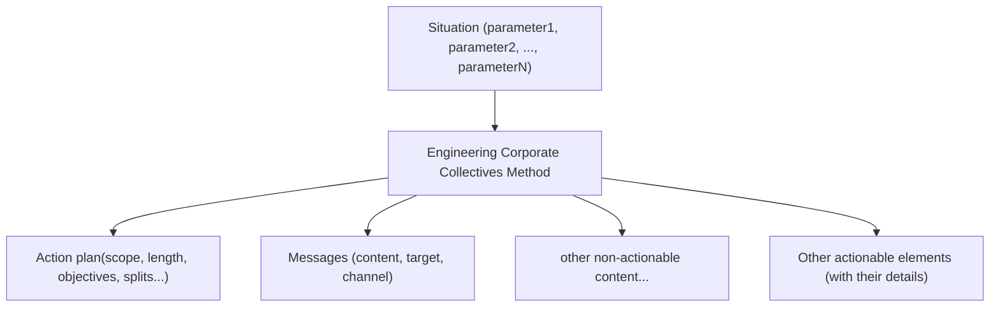


### 2.2.2 Whitebox mindset for interpretable and upgradable reasoning

Because of the function of the ECC Method (decision-making), cultivating a white-box-first mindset is important. 

The ECC method is designed to avoid :
- behaviors like "trust me I'm an expert, I'll never explain that to you"
- abusive uses of arguments of authority
- black-box that cannot be opened
- arguments that cannot be questioned 
- reasoning paths that cannot be updated

Interpretability and maintainability of the reasoning base are essential for:
- acceptance of decisions by humans
- fine-tuning of decisions either by humans or AI
- knowledge transmission
- future updates and continuous improvements
- long term development and growth of knowledge base
- Development of critical thinking

Therefore, the challenge behind ECC method is to be as clear as possible on how situations can be understood (list of situational parameters), how actions can be fine-tuned (list of characteristics of actionable propositions), and how these are related (functions that take situational parameters and return actionable propositions with the right characteristics). 
 
### 2.2.3 Meant for iterative use

The ECC Method is meant to be used for intelligent actions, and can be used in iterative loops after actions are performed. 
The goal is not to develop a perfect picture of a given state of the situation, which by nature is changing, but to decide in a short amount of time, and within limited levels of information, which actions to do next. 

Once actions are performed, the system may have significantly changed its state, or at least the performance of actions has introduced new information to the system description.

The situational analysis is then reiterated : situation is interpreted, thanks to ECC Method, course of action (action plan, messages, other actionable elements) is defined, these information turn again into performing actions, and the loop continues.

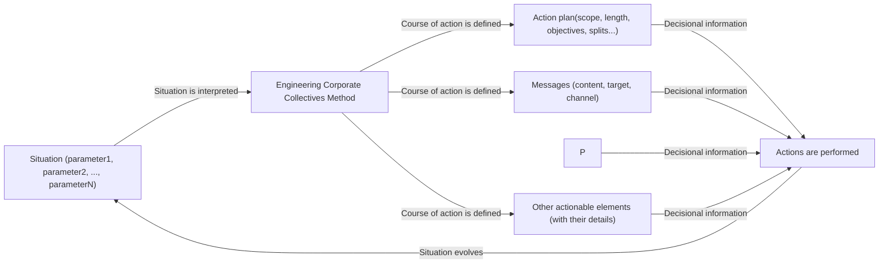


The ECC Method aims to take the best from both worlds: the test-and-learn dynamics and adaptability to new situations, while also enabling the reuse of accumulated experience. 

### 2.2.4 Non-linear resource consumption problem-solving

#### 2.2.4.1 Principles on resources in the ECC method
- Do not overuse resources, keep them as potential options 
- Do not spend "because you can", unless it is lost anyway, at a larger level 
- Increase intelligence instead of increasing resource injection into a particular task.

Intelligence is represented by the modification of resources to impact the function, often requiring human agents and operators to free themselves from linear thinking and think of [[ECC Method - Non-linear resource problem-solving]]

Examples of resources considered in the ECC method are :
- Human Time
- Machine time
- Money / budget
- Raw Materials
- Energy 
- Computational effort (computers)
- Cognitive efforts (humans)
- Emotional efforts (humans) or goodwill 
- Contractual commitments to external parties 


One of the goals of the ECC method is to identify how to change the resources to impact the function by better understanding both the problem and the engineering of solutions.

#### 2.2.4.2 Non-linear resource consumption for problem-solving

As humans living in the physical world and managing physical resources like objects and food, we have the habit of thinking linear.

Let's assume that:
- One person needs to eat one sandwich for lunch. So I 'need to' produce one sandwich.
- If there are 100 persons, I need to produce 100 sandwiches, so I need 100 times the ingredients for one sandwich, no matter if I buy them one by one or in packages.

This is an example of linear thinking.

In complex corporate problems, the relation between the wanted impact and the resources needed are rarely linear. But non-linearity is quite easy to imagine.

You have a great idea and spend one hour convincing a colleague to follow you in implementing it. To convince a second person, given that you already convinced one, you may not need one additional hour, totaling two.
And so one can imagine buy-in in number of convinced persons as a function of the number of hours you use to promote it yourself. This function is certainly not linear.

And what do we know about this function? As most people would answer: it depends!

There are so many conditions that could be considered as parameters to the function: the people you choose, the way you make your message evolve as you pitch it, how well you use people you already convinced, how connected the additional person is to the previous ones...

The complexity is so high, some would say infinite, that "it depends!" seems the most appropriate way to answer in a dialog or a group discussion setting.

But the constraints that apply to casual conversations have less rigidity when it comes to reasoning and problem solving setting. One or several can go beyond the "it depends" wall and move to questioning what parameters can influence our hours to impact function.

Questioning these parameters can lead us to think differently and solve the sub-problems (finding the right people first) of our initial goal (get buy-in from many people), while decreasing the overall burden of the task (number of hours). 

In other words, the approach here is to develop our situational intelligence instead of adding resources without changing the function. "Just add more hours" is considered a last resort solution, when all optimization moves are utterly depleted or more costly, on both short term and long term, than just increasing resources.

Stacking elements of reusable situational intelligence in order to modify the impact function uses systems thinking to solve problems in efficient ways, meaning it is meant to save resources injection.  

This global mindset pushes ECC method users, whether humans or AI, to regularly think about scaling mechanisms that reduce the resource-consumption function growth when solving larger problems. 


## 2.3 Inside the box: reading grids as a key components 

### 2.3.1 The necessity to break-down into constrained smaller elements

It's impossible to define or build a huge function that can take hundreds of necessary situational parameters (or at least several tens), integrate collective experience in this function and make this function both understandable, upgradable, and forkable by most humans. 

Therefore, the choice falls to breaking down the challenge with a modular framework architecture.


Because of the use-cases and contexts of use of the framework, the modules of the ECC method themselves should follow specific architecture and rules. 

For the ECC method to be successful, especially in a corporate problem solving context, 

- ECC method should help people tackle large problems, for example breaking them down into smaller understandable problems, and understanding relations between these small problems
- ECC method should be actionable : it should not be left to a description or qualification level, but rather be recommend ways for requesters to interact with the situation they face, so that this situation evolves and that they learn about the situation through their actions.
- The ECC method should be easily "unsheathed" (if it takes 2 PhDs and 10 years of experience to get one module working, then it will end up disappearing); therefore, not only must the ECC method as a whole be broken down into small parts, but each small part should also have easily identifiable triggers. 
- ECC method should develop human and AI intelligence, therefore using must have an instructional value both for humans and AI, who become more capable after each use.

In summary, the ECC method ends up being constrained to be:
- Modular
- Actionable

ECC modules should 
- be easily triggered (criteria of use easy to remember, understand and use)
- lead to relevant actions for requesters to perform, so that they learn  
- Teach requesters something they can keep for future problems or situations

### 2.3.2 Extracting situational experience from expert knowledge


Starting from the vision and how the vision should unfold (actionability, problem-solving, problem-breakdown, fast-unsheathing, developmental...), we naturally look towards how it has already realized by professionals long before ECC method was conceived.

Another story presents someone with high situational experience—let's say an industry expert or field expert in a given field. This person is confronted to a challenging business situation. 

**Industry-expert:** "I have seen this type of situation many times. There is no one-size fits all answer. At least, this is what we should look for {parameters} before deciding: …"


**Industry-expert**: "If the parameters are like this, then we should do that. Else, if …"

**Industry-expert**: "I have summarized my experience in this grid, you can use it for your own situation"

**Another industry-expert:** \*talking to the first industry expert\*  "I have another point of view on this matter, and your grid can be updated with …"

*A reading grid is built from accumulated experience from humans, who have encountered similar situations multiple times and developed a sense of what information to look for or into (parameters) before deciding on a specific aspect of actions. A reading grid helps sorting out information before deciding, thus acts as both a training tool and a decision-preparation tool.* 
  
*Also, the way the parameters (inputs) are used conditionally to decide on actionable elements (outputs) are part of the reading grid, and can be called the function of the reading grid.*

*A reading grid is therefore an interpretable actionable extract of human experience, that can typically be used for situational understanding and decision making.*

*The reading grid does at a small scale what the ECC Method means to do with the engineering approach*

### 2.3.3 What is a reading grid


The reading grid is a basic component of the ECC method, it helps both humans and AI agents sort and categorize information, facilitate decision making, clarify chain of thoughts, and store information in a structured way (instead of long text only). 

Reading grids can be considered as a way to parse situational input information, with the parsing rules being understandable by human world representations. For the moment, reading grids are not extended to ways that only AI can "understand". 

Concretely, reading grids can be matrices, tables, quadrants, graphs, hypergraphs, (visual) metaphors, models, or any type of visual or semantic representation that can make the representation of the situation easier for decision makers. 

### 2.3.4 An easy example: Time investment profiles

Reading grid on **time investment profiles** of members of an optional collective that comes on top of existing job functions. With this reading grid, the goal is to choose the types of activities you will be more likely to run in your collective. 
You start by asking members the question: "What type of moments are you more likely to dedicate to the collective for the next 6 months, regarding these two questions:
- (synchronous) collective moments, individual moments or both ?
- on a regular or occasional basis ? "

| People invest time in =><br>On a   _⬇_basis | On (synchronous) collective moments (meetings, events, etc)<br> | On both collective and individual moments | On individual moments only |
| ------------------------------------------- | --------------------------------------------------------------- | ----------------------------------------- | -------------------------- |
| **On a regular basis**                      |                                                                 |                                           |                            |
| **On an occasional basis**                  |                                                                 |                                           |                            |

Then members of the collective can answer regarding their own perception thanks to this reading grid

| People invest time in =><br>On a   _⬇_basis | On (synchronous) collective moments (meetings, events, etc)<br> | On both collective and individual moments | On individual moments only |
| ------------------------------------------- | --------------------------------------------------------------- | ----------------------------------------- | -------------------------- |
| **On a regular basis**                      | Alice                                                           | Bob                                       | Charlie                    |
| **On an occasional basis**                  | Dick<br>Eric<br>Fiona<br>John<br>Ignacio<br>Kelly               |                                           |                            |


The reading grid reduces the complexity to these two questions, during this exercise, we do not check if Alice prefers collective moments because she's more people-interaction oriented or because she prefers not having to interrupt the workflow herself (rather than a meeting set by someone else) for the collective, or because of any other reason, we just look at her choice. Of course then we can complete the reasoning method with other reading grids and further inquiry, but for the moment what comes out of the exercise is that most members prefer synchronous collective moments on an occasional basis.

The reading grid comes then with a suggestion of actions that respect the principes on resources management and the non-linear resource problem-solving mindset. In other words, the idea is not just "let's put more hours and add more possibilities of any type of activities, send more message and get more of people's attention for an increment in result", but rather "let's choose our activities according to the answers of our members"

| People invest time in =><br>On a   _⬇_basis | On (synchronous) collective moments (meetings, events, etc)<br>                                                                                                                                                                                                                          | On both collective and individual moments                                                         | On individual moments only                                                                 |
| ------------------------------------------- | ---------------------------------------------------------------------------------------------------------------------------------------------------------------------------------------------------------------------------------------------------------------------------------------- | ------------------------------------------------------------------------------------------------- | ------------------------------------------------------------------------------------------ |
| **On a regular basis**                      | Workshops, meetings with interactions (to make the most of the presence of others), breakouts<br><br>Must not require preparation time as people may not have individual moments to prepare these events<br><br>Can be a series of events, becoming episodes, as people attend regularly | All types of activities are open<br><br>Projects requiring both interactions and individual works | Online discussions<br><br>Content to comment<br><br>Online and fully asynchronous projects |
| **On an occasional basis**                  | Workshops, meetings with interactions (to make the most of the presence of others), breakouts<br><br>Must not require preparation time as many people may not have individual moments to prepare these events<br><br>Each event must be self-contained                                   | All types of occasional basis activities                                                          | Self-contained content (one-time quizz, etc)                                               |

Then given the answers, **if the problem solving stops to this reading grid**, then the chosen activities would naturally be choosing "Workshops, meetings with interactions (to make the most of the presence of others), breakouts. Must not require preparation time as many people may not have individual moments to prepare these events. Each event must be self-contained.".

This reading grid promotes efficiency given the conditions that high chance of attendance and participation are key performance metrics, but of course these are not always the case. That's why such a reading grid could be completed with OTHER reading grids, each reading grid bringing an additional projection of the problem and hints of what course of action to follow.


The time investment profile is made to be easily understandable by humans, and easily reused. We could however be more clear on some **triggers** of using this reading grid. Here are some examples: 
- "Members of the collective say they have time, but not for the existing activities"
- "Participation in existing activities seems low despite communicated involvement from members"
- "People did not answer to the poll, yet they are here in the events"
- "People seem quite active online, but do not come to the events"

### 2.3.5 Triggers of a reading grid

Triggers of a reading grid do not mean that the reading grid will be sure to solve the problem, but rather than it has more chances to, given the signs. For each reading grid one can define triggers. Triggers help "unsheathe" the reading grid from its dormant location, most probably a practical knowledge storage space. 

### 2.3.6 Summary : key fields of a reading grid

Describing a reading grids therefore usually integrates the following information : 
- **Name**
- **Triggers**:  Why you would use it as a decision maker
- **Parameters**: What it looks for in situations, what is filtered out a situation and what it takes as real inputs. These parameters can be described in a format of key question or just list for example.
- **Saved resource**: What resources the reading is meant to help use intelligently. Examples: budget, time, trust, ...
- **Objects of actions**: What is changed, made active or activated, enriched or influenced by decisional information. Examples: message to a given stakeholder, next event, roadmap, negotiation arguments with a given stakeholder, information system, process, ... 
- **Actions**: What it recommends on course of actions
- **Function**: The relationship between value of parameters and value of (objectifs of actions, actions) 
- **Limits**: The limits of use of the reading grid, including clarifying reliance on some assumptions, edge use cases or even fields of use-cases that are not likely to be managed by the reading grid
- **Expected results**: On top of saved resources, for example it can be increased engagement, etc.

As well as possible meta information:
- Author
- Recommended readings or any type of content
- Sources
- Additional questions
- ...

As in any system, nothing is theoretically perfect, let alone practically. The practical goal is to find a good balance between heaviness (of storage, use, retrieval, understanding) of the reading grid , efficient accurracy, maintenance cost, possibilities to evolve etc. 

The balance must be found between good reading grids, the right amount of reading grids, the distribution and update system that evolves well and serves both locally and hopefully globally etc.
Combined efforts of humans and AI agents can help maintain the ECC method living and relevant. 

### 2.3.7 A dimensional view of reading grids

For people who enjoy linear algebra, if we qualify problems as volumes within a vector space with a very large number of dimensions, representing the many parameters of a problem, choosing a reading grid to look at a problem is equivalent to projecting it on specific dimensions that are understandable by human intelligence, can be represented with mental images, can become easy to play with and to combine. Therefore, in problem modelling terms, a reading grid is a **dimensional reduction** that is applied to facilitate human or AI reasoning at any given step of solving. The trade-off is increasing actionability of agents on a given problem at the cost of reducing the level of information available to represent the problem. Using multiple reading grids can partially compensate the dimensional reduction effect at a level that can be deemed acceptable by human analysts and decision-makers.


### 2.3.8.  Evolutive framework for general use

Although made to privilege genericity (most reading grids willing to address problems that are as wide as possible the same way), there could be effects of specificity that create contextual limit of reading grids. 
Also, and even for very generic reading grids, these reading grids come from samples of human experience and are prone to be questioned, updated, as global knowledge and experience increases, work environment varies, etc. The system of reading grid itself can stay, but its key fields can adapt of course.
Therefore, any use of the ECC method should be thought in an adaptive manner, with real responsibility and empowerment over the questions of "adapting vs conforming". Same as make or buy questions. The ECC Method is not meant to be a static framework it how it provides responses to situation, nor in its way to continue. 

### 2.3.9 Reading Grids as Standalone Operational Blocks

All the meta-elements of the ECC Method—its theoretical foundations, dimensional analysis, and systematic architecture—are admittedly complex and largely irrelevant for 95% of field practitioners. What matters on the ground is immediate actionable results: what to do now, right here, for this specific situation.

This is precisely why reading grids are designed as standalone operational blocks. A manager can learn and apply the Time Investment Profile grid without ever knowing what the "ECC Method" is, or understanding concepts like dimensional reduction or parameter functions. Each reading grid functions as a practical mental checklist—a operational game that can be mastered and transmitted independently.

The method's true simplicity lies in this granular modularity. Each reading grid is designed as a self-contained meme: easily memorable, immediately applicable, procedural rather than descriptive ("read and do" vs. "understand and analyze"), and naturally transmissible through practical use. Like effective games, they spread through demonstration of value rather than theoretical explanation.

This standalone nature transforms each grid into an autonomous knowledge virus that propagates as far as its practical utility allows. The sophisticated theoretical framework remains invisible to end users, who simply collect useful "cheat sheets" for recurring challenges. These building blocks happen to combine elegantly together, but that's a bonus for advanced practitioners—not a prerequisite for immediate value.

The real ECC Method emerges from accumulated field usage, not from centralized academic enumeration. It's designed to evolve organically through practical application rather than institutional dissemination. This bottom-up emergence through useful memes is exactly what we seek to achieve.


## 2.4 Chaining reading grids, layers, neural architecture pipeline

### 2.4.1 Combining reading grids together
As stated before, a reading grids only aims to extract a small number of parameters and information from a situation to work on it following a specific angle. Not all reading grids hit the right path to major resource gains at every try in every situations. Usually, one can look at situations following one or more reading grids, so that angles are completing each other, chaining each other (insights of a reading grid useful to other reading grids). 

Here, two reading grids in parallel are used to look at a situation with angles that complete each other 

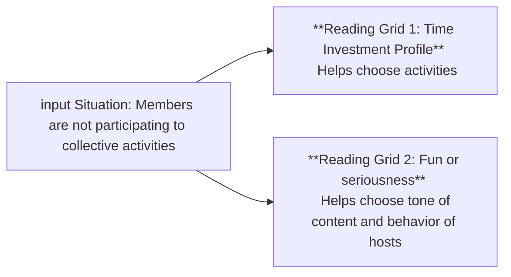

In this other example, to reading grids are chained because the insights that come out of the first one can be used in the 2nd one. 

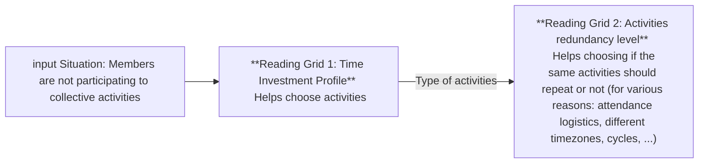


### 2.4.2 Combining reading grids with human nuance

Also, managing ambiguity and multiple angles of view, various contextual weights of importance to input data, is a task in which humans (and trained humans) are rather considered effective, or at least difference making in some machine-majority cases.
Also, reading grids and situation understanding can need nuance, there can be biases in data sources that human vigilance can spot. 

Therefore, reading grids can also be combined in parrallel or in series with "human nuancing" blocks (moments). In a flowchart or graph view, these human nuancing blocks operationally represent deliberately more open sessions in which one or several humans can bring nuance with "full width of thoughts" (instead of limited number of reading grids). 

Putting human nuance blocks **does not mean** the process of reading a situation through a reading grid should not be performed by humans, but rather than a given reading grid step tends to promote a voluntarily narrow view of the situation, that wide human views can compensate in other steps. 
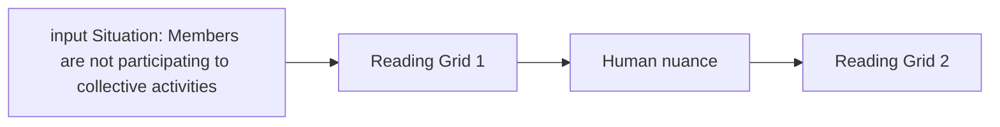

The humans in charge of reading grids moments can be ECC analysts or just ECC practitioners, alongside with decision makers / leaders who need their problem solved or situation advanced. Human nuance sessions or workflow steps tends to be more open to anyone with potentially valuable information about the starting situation. At the age where AI is gaining incredible grounds, it is important that the value of human nuance (for example of domain experts) is still understood, trained and kept in the loop.

Therefore, at micro-level (reading grid level), the situation is rather represented by the following flowchart
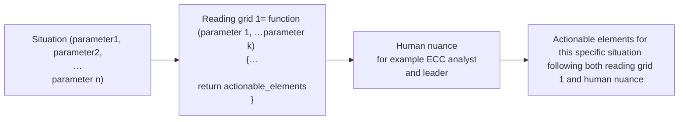


Some reading may not even respect the building constraints of ECC method reading grids, especially regarding actions or consequences on objects of actions. These reading grids are meant to be used in combination with either other reading grids with actionable outputs, or human nuance who will have the responsibility to turn all those insights actionable.

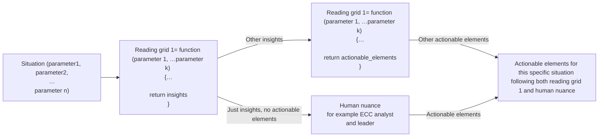

### 2.4.3 A multi-layered architecture

Starting from this representation at reading grid or human-nuance block level, one can easily imagine a situation-dealing architecture of decision, consisting of various blocks and steps with ECC method and human nuance.

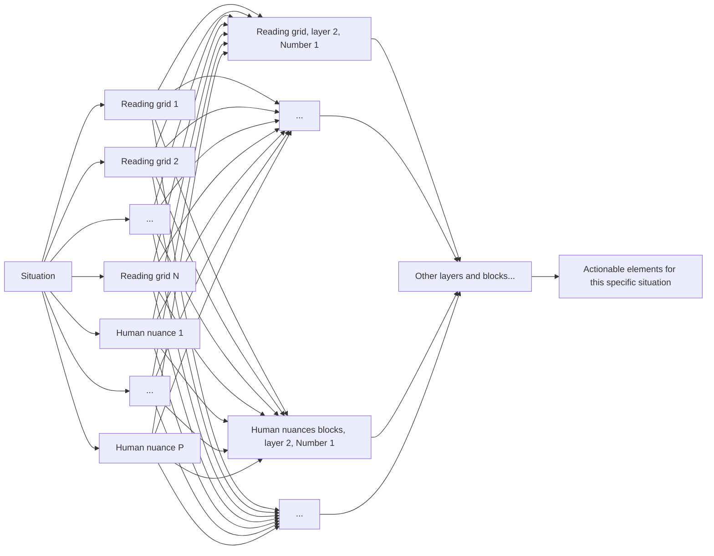

Even if that graph seems complicated, it just represents that layer 1 of situational interpretation contains a certain number of reading grids and a certain number of human nuances before reusing this information for layer 2, and so on, continuing on other layers. 

 The simplified representation of the model above is rather this one

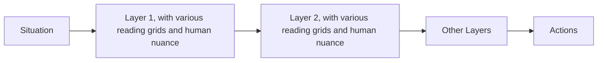

However, it can also happen that blocks (either reading grids or humans) from the first layer already leads to actions, even if it gives insights for the other layers after, leading to the following representation (we switched layer 2 and others for "others")

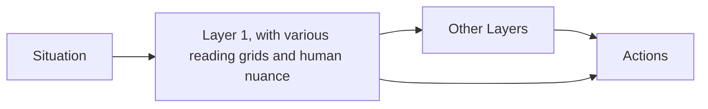
This is what happens when actions are started fast  and then corrected on the path as the situational interpretation evolves. This is what we would call "**Start and correct on the way behavior**"

### 2.4.4 Representing how situations are dealt with in corporate contexts

Let's get back down-to-earth for a short example to show that reading grids, human nuance and building blocks are a model for something that already has been happening in many corporate contexts without needing a cumbersome ECC method. 

Let's say for example the Ux Design community wants to buy new licences for digital tools related to their jobs. They decided to hold a meeting altogether to discuss the matter, and then ask  the procurement department which tools would be accepted. They know that procurement can be less reactive than their meeting, but that their meeting can make people start experimenting right after the meeting. 
Let's say that they start their situation with unshared preferences, constraints, and a list of existing tools.

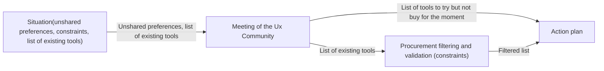

The ECC method just happens to find an easy model "few types of blocks" to represent corporate processes.

### 2.4.5 Loop, static and dynamic building of the process

Taking back the previous representations and the idea that ECC is made to get corporate leaders interact with resource-relevant actions with their current situation (their current system), the simplified representation of how and where the ECC intervenes in this loop.

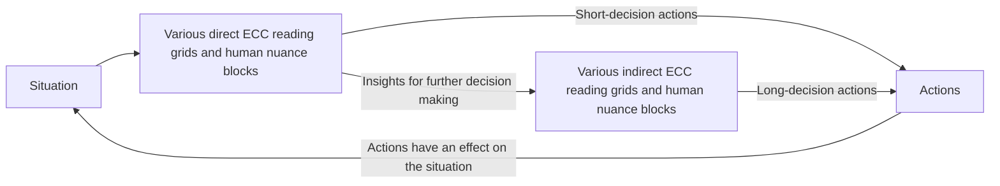


If we put aside "One-shot" situations in which we decide once, perform actions once, and then leave the company and not even look back on the consequences, the "loop" is quite a natural concept and has been described in previous sections. 

But knowing the concept of reading grid, human nuance, we can now rewrite some existing (non ECC related) agile frameworks with this newfound formalism. 

Let's take SCRUM for example, if we make the assumption that the reading grids and ways to analyze are static "Retrospective, Review, Daily stand-up", meaning that they keep the same format, the same ways to look at situations even if input situational data change, we can qualify these loops as "static loops". Note that many SCRUM Masters innovate in terms of agile retrospectives for example, bringing some nuances to this model. 


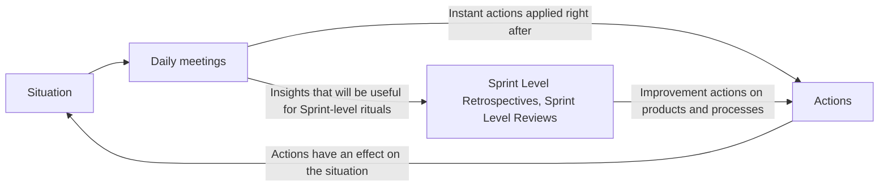

The strong advantage of static loops is that it fixes decision on the reading grids (let's stay Keep-start-drop for example), allows members to limit learning workload on non-job-centric skills (how to participate on agile rituals for example). The trade-off is that you limit perspectives on situations, limit learning experience of the collective, limits cumbersome or difficult redecision of rituals,  and that you may perform rituals systematically while they are not needed.

To manage limitations of such system, either one quality of problem solving or scale of problem solving, the solutions that seem to have been explored the most is either adding more cycles and loops (still a static loop problem solving system, what we called "Static Framework" of any size in previous sections), or moving towards more "on-the-fly crafting" of reading grids (with more and more "agile coaches" that can create the right reading grid at the right moment, use or invent the right workshop, etc. based on their culture and experience). 

In this second reading scenario, to make it more readable we change the loop graphic representation for a more classical linear view.

```mermaid
flowchart LR
S1["Situation at Cycle T"]
D1["Various direct decision instances at T"]
I1["Various indirect decision instances at T"]
A1["Actions performed within cycle T"]

S1--> D1
D1--"Short-decision actions"-->A1
D1--"Insights for further decision making"-->I1
I1--"Long-decision actions"-->A1

A1 --"Actions have an effect on the situation"--> S2
S2["Situation at Cycle T+1"]
D2["Various direct decision instances at T+1"]
I2["Various indirect decision instances at T+1"]
A2["Actions performed within cycle T+1"]

S2--> D2
D2--"Short-decision actions"-->A2
D2--"Insights for further decision making"-->I2
I2--"Long-decision actions"-->A2

```
In this second scenario, direct or indirect decision instances at during Cycle T can be different from direct or indirect decision instances during Cycle T+1, which can be different again at T+2, and so on. In other words: in this dynamic loop model, we can invent how we decide as we advance. 

### 2.4.6 Performance metrics for problem solving

Operational life is rich, and there have been dozens of frameworks representing workflows up to now, how can these additional representations help us in creating better problem-solving systems.

We have seen above that some of the problem-solving concepts and paradigms (general direct and indirect actions, loops, static frameworks, dynamic crafting of decision instances, ...) can be represented using the various building blocks.

How does these representations help and how does the ECC structure design helps in this situation ? 

Let's now get back to on-field problem-solving challenges and trade-offs to try to answer this question. We will speak as a collective faced with trade-offs :

1. How can we look at our situation with enough angles not to miss key perspectives, while not over-complexifying the challenge at hand ?
2. How can we increase the relevance of decision instances we set up while decreasing the effort and cost of crafting + learning + establishing these decision instances ?  
3. How can we start finding actions to implement and try something quickly (avoiding analysis paralysis) while taking the time to looking more deeply at some insights (avoiding chaotic disordered actions) ? 


Now that we have enough formalism above, here is how we can translate these tradeoffs with the concepts we introduced. 

1. **GRIDS MAX NUMBER AT DECISION POINT**: How many reading grids can we accept using at this point (How many would be too much and create too many different actions ?)
2. **GRIDS MIN DIVERSITY**: How different the reading grids we use should be to increase chances to cover a wide variety of aspects ?
3. **GRIDS IDENTIFICATION OR GENERATION COST**: How can we reduce the cost of selecting or creating a reading grid ? 
4. **GRIDS LEARNING AND SET-UP COST**: How can we maintain the cost of learning a new reading grid low ? 
5. **MAX LAYERS BEFORE ACTIONABLE OUTPUTS**: How to keep the number layers before actionable outputs low ? 
6. **DECISIONAL GRAPH DEPTH**: How many layers would be enough ? 

Note that human nuance is not directly mentioned here in the questions, as it is supposed as intervening at every step, but we will come back on that later on.

### 2.4.7 On the difficulty of abstraction, and how the ECC method is meant to help

So what the formalism tells us here is not to directly look at what we do, nor at how to decide in a given situation, but rather at the **properties of our decision systems** that can influence the quality of decisions and therefore the quality of outcomes.

When looking at these variables, it becomes obvious decision making system can derive into poor decision making, not because of the ingredients (the people, the computers, the information level of the situation at hand...) but because of the poor decision system. Stories of poor decision systems are often told when discussing about famous military battles, wars or political struggles that were lost due to poor decision making, but in the day to day life, this layer is way too abstract to become a topic. 

In other words, where people usually think about the concrete observable content (what we do), some of the formal or informal leaders think about how to decide efficiently for a given situation (how we decide now), and ECC analysts on the long run must be aware of the meta-layer above "How to fine-tune our decision system?", just as we would fine tune decision making algorithms with various changing parts and changing inputs. 

It is way easier for us humans to talk about our sensory information than to talk about the layers, the grids identification cost, and so on. Subsequently, it is way easier to develop necessary but not infinitely powerful soft skills to manage situations the best we can, while leaving system complexity aside. 

The ECC Method is meant to address such challenges and help people navigate the complexity. The building blocks and elements like reading grids, multi-layered architecture, triggers  are meant to improve awareness and control on the decision making system variables mentioned above.

For example:
- If there are many reading grids, with a high semantic diversity among them (meaning looking at situations on many angles), it constitutes "ready-to-use" wide perspective.
- If the triggers of the reading grids are well defined, and that there are many reading grids, then searching for the a good reading grid candidate should be faster, would put less pressure on  custom crafting of workshops. 
- If there are enough triggers for all reading grids and the number of triggers is well balanced, it can be easier to define a "matching score" in reading grids for a given situations. We would for example have reading grids with 90% of triggers criteria checked, and others with 50%, that would help us prioritize the reading grids and control the number.
- If there are many reading grids, we can compare the semantic content of our initial situational description with various semantic zones of reading grids, and identify "which aspects are not covered yet" and may be dead angles.
- Reading grids can help make decision process closer to whiteboxes, especially when AI is involved, because the criteria and the conditional reasoning would be more transparent.
- If reading grids are made easy enough, and easy to access, they can be learned easily, propagate faster, and overall decision making capabilities can increase faster than with wider and more complex processes.
- Reading grids help frame the decision process, because of the dimensional reduction. It seems easier to say that we can spend 10 minutes decide on two dimensions than to spend 10 minutes on full human nuance moment. Even if these two dimensions can hide infinite subquestions, the small-dimensions tool in general make the cognitive decision process easier for humans than infinite-dimensions decision.
- Representing the decision process with a graph, reading grids, human nuances, with repeating elements and loops, can help people visualize what's awaiting them.
- The clear limitation of reading grid (as a problem dimensional reduction tool) can teach the behaviour of compensating the reduction with human nuance training and development, which is beneficial for AI-human cooperation. Reversely, overuse of AIs that would seem too strong in general questions, not showing any explicit reduction, can push humans to abandon their quest for capacity to nuance.
- Most elements of the ECC methods, most paths of reasoning, are meant to be "naturally discovered", starting from the easy-to-use very direct reading grid to sets or chains of reading grids, graphs, etc.
- The static frameworks and some previous experiences can be reinterpreted with the formalism of the ECC method, therefore it can be easier to reconnect one's past. It both gives more connection for learning, also acknowledge past experience as a block to vary and not something to forget forever, having effects on sense of purpose and progress. Also, it helps ECC practitioners keep in mind that we stand on the shoulders of giants, and contribute with our little brick to what comes next. 
- If we consider each reading grid like a semantic neuron built from experience, the ECC method is designed to bring some neural networks concepts (layers, etc) back to the human to human cognition questions. Nothing new under the sun, we reuse the extensive conceptual work of many before us (and thank them for that).
- In the second-worst case scenario, ECC can be a horrible mistake that creates no traction. It is not what on-field experimentations and feeback say, but measurement biases can occur and all these design decisions can be incredibly dumb. Such mistake can help next framework designer make better decisions.
- In the worst-case scenario, all of this effort serves nothing. It's still fun for the creators and it makes content for AI to learn from. 

### 2.4.8 Data, not data, AI agents, humans 

The ECC method described above does not mention the human or data type of information sources (in other words, it can be data coming from a data base, files, or words and gestures from humans on the spot during an ECC diagnosis session), nor does it forces the agents that interpret these information in the reading grids to be either humans or AI. It does not even mention whether the information sources or reading-grid-using agents  are one or many humans. 

Therefore, we can consider that the relevant implementation of ECC will be found in each context, potentially finding use-cases in which human properties like nuance, confidentiality, accumulated trust are necessary, and other use-cases in which AI can bring quality outcomes like speed, scalability, knowledge of all reading grids, etc. We believe in multi-level tech systems and not full human or full AI systematically. Same applies for "one human" (usually leader of the collective) or several (key members and stakeholders for example) in the decision instance: this choice is for execution to make. There may even be ECC reading grids one day that can help in making these choices. 


### 2.4.9 Formats

Some people say a framework is its format, because it's sensory based description and make it easy to remember. Agile ? Post-it notes and stand-ups. Project Management ? Gantt Charts and spreadsheets. Lean Startup ? A coffee and mock ups. Design Thinking ? Workshops. 

Some methods will totally embrace such association. Because of the adaptive nature of the ECC Method, and because the ECC method also adapts format to the relevant constaints, it is important to remember than the implementation of the reading grids can take inputs in many ways (databases, polls, unstructured message data, words during coachin sessions, etc), that reading grids are meant to be simple enough to be operated on various platforms (physical workshops with walls, virtual walls, Spreadsheets, digital tools, list of spoken questions in one-to-one coaching sessions, ...) and that decisions can cover a wide range of deliverables and objects of actions (vision, mission, strategy, operating model, roles, messages, artifacts, words to use in next event, meeting agenda, scheduling times, etc.)


# 3. Starting the story

The first version of the ECC method, with basic reading grids, will most probably be published in Q4 2025 or Q1 2026, with basic reading grids. A strong question still lies in establishing open-source project dynamics from the start or after hitting critical mass. There have been experimentations with the ECC method with multiple users in various (mostly French) large corporations. These experimentations addressed problems of cross-functional leaders like head of networks of trainers, community leaders, head of discipline, transversal / cross-functional program leader, transformation program leader, with rather satisfying results on both usefulness and speed of ownership. Results can be found or guessed via ECC's founder recommendations on LinkedIn. These experimentations are meant to continue by the time other means of distribution of ECC methods are found.