# One Week Deep: My First Real Vibe Coding Experience with YT2ActiveText

*This article was co-written with Claude AI for translation, reformulation, and structure. It is the fruit of a real dialogue and reflections, not an automated article created from standardized content for filler purposes. I wish everyone a good read.*

*This article is dedicated to my project partner Damien Theodorou, with whom I developed YT2ActiveText and who taught me invaluable lessons about systematic development and documentation practices.*

## The deceptively simple idea that started everything

For years, I've been watching people around me—myself included—lose their capacity to focus on difficult intellectual tasks. Attention spans seem to be shrinking everywhere I look, and I'm not immune to this erosion.

Whether this is a global phenomenon or just my local observation, I decided to take action. I wanted to protect my attention span, maintain my ability to focus deeply, resist the allure of quick dopamine hits, and preserve my critical thinking abilities for the long haul.

I've already eliminated personal social networks from my life, keeping only LinkedIn for professional purposes. But among the remaining "attention streams" I wanted to tackle, YouTube remained the biggest challenge. 

The problem isn't just the algorithmic feed that keeps you scrolling endlessly. It's the video experience itself. Don't get me wrong—video is engaging precisely because it's visual, rich, sometimes containing artistic elements you simply can't express with words. I respect that form of communication.

But here's what I noticed: video primarily appeals to our visual processing, somehow engaging less of our cognitive machinery than reading does. When I read a book or text, I'm actively constructing mental models, playing with words, symbols, grammar, and meaning. My mind works harder to imagine, to connect, to synthesize. With videos—even thoughtful, long-form content without quick cuts—I slip into a more passive consumption mode.

I was ready to make a deliberate trade-off: willingly lose some non-verbal information in exchange for a more cognitively active experience. The goal wasn't to dismiss video as a medium, but to transform passive video consumption into active reading engagement—complete with quizzes, self-reflection prompts, and conceptual exercises.

Yes, it takes more time. But it keeps my mind in better shape for the long run.

The YouTube Vortex had become my last frontier of attention hijacking, and I wanted to flip the script entirely.

This wasn't really a sudden "eureka" moment born from frustration. It was the natural culmination of years of comparing different modes of content consumption. I read voraciously, my circle reads extensively, we discuss, debate, philosophize. I watch relatively few films and videos, despite having a cultural appreciation for them. My cognitive preference has always leaned toward reading, conversation, and active reflection rather than sensory immersion.

The idea was inevitable, really.

What's particularly amusing is how backwards this approach seems in our current AI landscape. While most people are using AI to transform text into images, to reduce cognitive load further and further, I'm doing the exact opposite. I'm using AI to transform video into text, into exercises, to make our brains work harder and more actively.

It's a deliciously counter-cultural use of technology: instead of optimizing for ease, optimizing for cognitive engagement. (Our brains can always rest by watching videos later, after all.)

So the question wasn't really "how hard could it be?" It was more like: "Let's see what happens when we use AI to swim against the current of cognitive simplification."

That's how YT2ActiveText was born. Damien and I wanted to fight back against the endless scroll of passive consumption, to reclaim control over our attention. The philosophy was clear: instead of being swept away by YouTube's algorithm, we'd transform videos into active learning experiences.

One week later, I'm staring at something that's very far from perfect. The script doesn't work flawlessly by any stretch—it struggles with certain video types, sometimes fails on audio quality issues, and the quiz generation can be hit-or-miss. But there's an architecture that sort of works for some videos, and more importantly, there's a framework for thinking about this kind of problem.

This week wasn't about building a polished product. It was about understanding what vibe coding actually means in practice, discovering the hidden complexities that emerge when you try to build something real with AI assistance.

## Episode 1: The reality check hits hard

**Day 1-2: When "simple" reveals its true nature**

I launched into this thinking it would be a weekend project. Download some audio, run it through a transcription service, add some quiz questions with an LLM prompt. Done, right?

The first reality check came when I started exploring what was actually available in the open source ecosystem. Beyond the obvious Whisper, there was yt2doc, various diarization tools—I didn't even know "diarization" was a concept before this week. The landscape was richer than I'd expected, but each tool solved only part of the puzzle.

Then came the cascade of use cases and edge cases I hadn't considered: What if the video has no speech, just music? What if there are multiple speakers talking over each other? How do you detect the language automatically? What about videos that mix multiple languages—do you need separate workflows or can one handle both? What parts of this pipeline can I reasonably run locally on my machine versus requiring cloud services?

Each question I answered revealed three more I hadn't thought to ask.

**Lesson 1: The complexity iceberg principle**

Every "simple" feature in vibe coding is actually an iceberg. What you see on the surface—"convert video to text"—represents maybe 20% of the actual work. The other 80% is handling edge cases, quality variations, timeouts, error states, cleanup, logging, and all the boring infrastructure that makes things actually work reliably.

The trap I fell into was thinking speed equals simplicity. Claude Code can generate code fast, but that speed can mask the underlying complexity. You end up with something that works for your test case but breaks in twelve different ways when real users touch it.

The antidote became systematic thinking upfront. Before asking Claude to implement anything, I started documenting: What are the edge cases? What can go wrong? What does "done" actually mean? This slowed me down initially but prevented countless debugging cycles later.

But here's what I found unexpectedly valuable: embracing the fact that there will always be more questions. Instead of seeing unknowns as problems to eliminate, I started seeing them as healthy signs of continued learning. Having "known unknowns" keeps us humble and reasonable, and actually improves our relationship with uncertainty. 

The questions never stop coming, and that's actually a good thing—it keeps both curiosity and learning alive.

## Episode 2: When AI becomes your debugging buddy (and your biggest headache)

**Day 3-4: The debugging partnership**

Something fascinating happened around day three. The relationship with Claude Code shifted. Instead of giving it simple commands like "do this, do that," I found myself providing rich context: "Here's the problem I've noticed, along with the most complete ground-level explanation I can give you, with examples, counter-examples when possible, key concepts, and a summary of what I'm trying to achieve."

It's not a formal "CRAFT" methodology for every interaction, but there's an underlying principle: certain working concepts need to be established, integrated, sometimes written down or repeated to be considered central. Like working with a human, really.

This led to actual debugging conversations, but first I had to learn to ask Claude to sprinkle console.log or print statements throughout its code. Debugging something you supervised but didn't write yourself is remarkably difficult—that became a crucial lesson.

Around the same time (though the web debugging came later on day 6), there were plenty of cases where code generation itself would go off the rails. Files ending up in wrong directories, processes hanging indefinitely, logic that worked in isolation but failed in integration.

**Lesson 2: What you must systematically understand, even when it works**

This raised a crucial question: what should you always know about AI-generated code, even when it's working fine? 

A telling example was timeout management. When you launch a process, especially through Claude Code CLI, the timeout is how long the system waits before killing a hung process. Too short, and you get constant interruptions before completion. Too long, and you can't detect when something's actually stuck in an infinite loop.

To set reasonable timeouts, I had to ask Claude to build in progress declarations and status updates throughout execution. Not perfect, but the principle became clear: AI-generated code needs plenty of feedback loops and visibility into what it's actually doing.

The broader lesson was about debugging code you supervised but didn't write. You need to understand the system's behavior patterns, not just its success cases. When things go wrong—and they will—you need enough instrumentation to diagnose problems in code that might be structured completely differently than how you would have approached it.

This is where I started questioning the whole "vibe coding" concept—as if it's just about feelings and impulses, with some orderly assistant helping us intuitive, messy humans organize everything because it has infinite energy.

Here's an analogy: I know many couples where one person is very disorganized and the other is serious, full of willpower and self-sacrifice, ready to clean up after them. These couples' homes are NEVER actually tidy or well-organized, and it often creates relationship problems and frustrations. Why? Because disorder cleaned up by someone else is still fundamentally disorder. It generates enormous cumulative costs in sorting, searching, and loss.

Vibe coding works the same way. You can choose to do vibe coding for small prototypes and proofs of concept, push an idea forward—and I'm sure many people get far with this approach. But it's not as easy as it seems because there are countless considerations that are actually CHOICES.

A prototype project and a production-ready project are both legitimate, and CLIs shouldn't have to choose between them (they could ask, actually). But this means you can end up with "POC-level" disorder where things get added here and there. The moment you want to add a feature or make a modification, it becomes a game of pickup sticks or a tangled mess, with enormous computational (energy and ecological!) costs for NOTHING.

AI is great, but using it to compensate for stupidity we could avoid ourselves? That's just stupid.

## Episode 3: Documentation becomes your secret weapon

**Day 4-5: The infrastructure revelation**

This is where things got really interesting. Damien had been pushing me toward systematic documentation from the start, but I was resisting it as "overhead." Then I hit the wall where Claude Code kept losing context between sessions, and I found myself re-explaining the same architectural decisions repeatedly.

The metaphor is simple: every time I restart Claude Code, it's a new onboarding. And you don't realize how much thinking happens between Claude Code responses—all the mental representations you don't take time to write down, all the requirements you never note anywhere. Even when you put them somewhat explicitly in prompts, they don't necessarily resurface intelligently the next day when you launch a new Claude Code CLI session, or after automatic context compression, or when you have to restart your computer or step away for any reason.

It's like "having a new intern every day or every two hours."

Hence the necessity of persisting context yourself, even outside sessions, so you can just say "okay, read what happened." I'd lived this before in my previous lives as SCRUM Master, operational coach, entrepreneur, product manager: document, document, document. You never know when a disruption will make you lose knowledge that seems so accessible when it's in your working memory.

This drove home the importance of creating a README, then an EXPERIENCEHISTORY (like in real life—document what failed too!). I've spent recent years supporting leaders of cross-functional collectives who don't have the luxury of dedicated teams to document on their behalf—sometimes communities of practice, working groups, etc. They must constantly capitalize on their members' experiential information (best practices, yes, but also mistakes) so that the group's intelligence and shared experience saves everyone time.

Same principle here: better to over-document everything that happened, tell the story of exchanges and back-and-forth, let it accumulate so you can search the history (even if you clean it up later), rather than let it rot in the abyss of forgetting.

But then you hit the question: "Where's the limit? What should we document? Should we document the fact that we're documenting? Haha, etc." That's why we ended up writing a best practices guide for starting vibe coding projects—best practices for humans, and best practices to have the CLI read before beginning.

**Lesson 3: From prompt engineering to context engineering**

I recently read that people have moved beyond prompt engineering to context engineering—which makes much more sense. The idea is no longer the technicality of how you write to the LLM, but what you put in so the response has a chance of using relevant information.

Knowing what information is relevant, how to recall it without completely eating up the attention window or drowning it in noise—this is fascinating, and these are surprisingly the same questions I've posed and had teams pose so many times when they're renewing, when people replace each other for vacations or job changes: What part of the context is interesting, and how do you compress this information to pass to your successor, in the most readable way possible for everyone (without requiring a particular style or reading ability) and efficiently?

A concrete example for humans: the global project explanation format (in README.MD) using 3 stories—one 2-minute, one 5-minute, one 15-minute. This way humans don't read bullet points but a real storytelling adventure (which corresponds to how they consume information). Same for vibe-coding best practices: I had a human checklist written with a manageable number of points for humans starting a project, and an AI checklist with tons of points.

Fundamentally, working in TDD is a form of documentation (an automated test is a form of active documentation! and its automatic run forces this doc to stay current). Now that documentation costs much less, I think there's enormous potential for automated testing. It was in this project that I understood the power of a TDD approach (coding tests before code) which forced me to think through many things and save messages and iterations with Claude Code.

In traditional development, documentation often feels like administrative overhead. In vibe coding, documentation becomes the infrastructure that makes everything else possible.

## Episode 4: The architecture emerges from chaos

**Day 5-6: When complexity demands structure**

By day five, our "simple" project had evolved into a complex pipeline: parallel processing threads, multiple transcription sources, LLM fusion logic, web interface, error handling, logging systems. The initial "quick and dirty" approach was breaking down under its own complexity.

This is where the real learning happened. We were forced to think architecturally. How do you organize code that's being written collaboratively with AI? How do you maintain consistency when you're iterating rapidly?

We ended up with something resembling microservices architecture, even for a small project. Here's what the final pipeline looked like:

```mermaid
flowchart TD
    A[📹 YouTube URL Input] --> B[📊 Metadata Extraction]
    B --> |yt-dlp| C[🎬 Title, Channel, Duration]
    
    C --> D[⚡ Parallel Processing - 3 Threads]
    
    D --> E[📝 yt2doc Thread]
    D --> F[🎙️ Diarization Thread]  
    D --> G[📱 YouTube Transcript Thread]
    
    E --> H[🎯 High-precision transcription]
    F --> I[🎵 Audio + Speaker separation]
    G --> J[📄 Official YouTube subtitles]
    
    I --> K[🎤 WhisperX + Speaker attribution]
    
    H --> L[🧠 LLM Fusion Engine]
    K --> L
    J --> L
    
    L --> M[📖 Normalized Content]
    M --> N[✨ Active Text Transformation]
    N --> O[🎯 Final Quiz-Rich Learning Document]
```

Separate modules for audio processing, transcription fusion, content transformation, web serving. Each piece had clear interfaces and responsibilities.

**Lesson 4: Architecture emerges through iteration, but principles matter**

I can LARGELY improve here because I didn't think in microservices from the start, and I now understand the value of doing microservices on one side and orchestration on the other. But this was the fruit of iteration—the initially somewhat monolithic code was refactored many times.

Because despite having macro "user" intentions (or more sophisticated product manager/owner perspectives), understanding what happens inside is still necessary for debugging if you don't want an unmaintainable system that's unstable half the time and slow.

The solution was indeed establishing architectural principles upfront, but clearly I wasn't there at all initially. Fortunately, through iterations and with documentation, it eventually emerged. But the Mermaid diagram you see above is really the fruit of iterations because you can't think of everything.

In any case, it's important to think both about function and component architecture, whether you want to or not. So no, vibe coding isn't magical in the sense that "we forget everything," because beyond a certain number of features, this complexity catches up with you. Even though the iterations to launch were short, with logs etc., it wasn't instantaneous either, and test-and-learn must still lead to something.

Test-and-learn is still a guided process for now, even with a project vision in the README and a rich experience history (rich documentation, basically).

This was counterintuitive. I expected AI assistance to make things more informal, more "move fast and break things." Instead, I discovered that working with AI requires more architectural discipline than traditional development, even if that discipline can emerge iteratively rather than being perfect from day one.

## Episode 5: The human responsibility intensifies

**Day 6-7: What remains irreplaceably human**

This wasn't really a final revelation but more of a confirmation: each component you add brings complexity, this complexity isn't fully manageable by AI and requires supervision one way or another, each small component can break everything else, and disorder in intention also creates disorder in execution.

In short, we have and will still need humans with critical thinking, imagination, the desire to break codes sometimes and respect them sometimes. Even if—even if, even if—AI becomes good at this, humanity must still keep these skills. Because there are still things that happen without devices, without AI, that need these qualities. Because creativity, the ability to think broadly, differently, unexpectedly compared to the past, are drivers of innovation and creation.

With all the respect and taste I have for AI—and I've consumed a lot of training, written articles, tested products like everyone else—I realize the mountain is still high both for us to climb the ladder of our next progress, and for AI to integrate healthily with us, even though it's moving super fast.

There were moments of frustration, moments of calling or self-calling for patience, moments of joy, ethical considerations, fundamental choices, tests that led nowhere at all (for example, the one on music detection, music-speech separation, which were enormous testing efforts for not much). But that's what makes a project ultimately work—that all of this integrates well into something sustainable for humans, not just in terms of material or electrical resources, but also emotional and cognitive ones.

**Lesson 5: Human sustainability in an AI-accelerated world**

Creating projects that exceed us as individuals is beautiful, but augmenting our capacities to better embrace what we work on, create more beautiful things, and serve better—that's beautiful too.

The final lesson was perhaps the most important: vibe coding isn't about AI replacing human developers. It's about finding a sustainable way to amplify human capabilities while preserving what makes us essentially human—our creativity, our judgment, our ability to see the bigger picture and make it meaningful.

## The emergence of a new craft

Looking back on this week, I realize I wasn't just learning a new development methodology. I was discovering a new form of craft that combines technical velocity with strategic depth.

Traditional development often forced a trade-off between speed and quality. You could move fast with messy code, or slow and deliberate with clean architecture. Vibe coding, done well, collapses this trade-off. You can move fast and maintain quality, but only if you develop new skills around context management, architectural thinking, and collaborative AI interaction.

The most surprising discovery was how much this approach demanded of me as a human. Instead of being made obsolete, my role became more essential and more intellectually demanding. I had to think more clearly, communicate more precisely, and understand my intentions more deeply than ever before.

**From technical execution to strategic intention**

But there's something even more fundamental happening here. With CLI tools and AI, we're witnessing a progressive removal of technicality—the need to memorize specific interfaces, commands, or syntaxes—to refocus entirely on intention: what we actually want to accomplish in the real world.

It's like having an extremely well-designed interface that only takes natural language as input. This is liberating for creativity rather than getting bogged down in the details of which button to click or which programming language syntax to remember.

The knowledge that remains crucial is understanding potential and capabilities—what can be accomplished—but no longer needing to retain exactly which command or sequence of actions achieves it. That layer is handled by AI.

**The bulldozer metaphor**

I've experienced this personally with bash Linux, Python, open source libraries, JavaScript, etc. Of course I had to develop an understanding of the objects I work with, but not necessarily the details of their manipulation. It's like being in a large crane or bulldozer with an automatic selection head: I remain the architect, I think about which element goes where and why, but I don't have to determine the selection mechanism myself.

The CLI has been a truly liberating experience. It allowed me to access my computer's resources rather than being locked into web interfaces. I can call much more context, work with peripherals, files. After so many years trapped in the "non-abstract" layer of Windows GUIs, I'm finally realizing the power of the command line, where you can think in intentions rather than manipulations.

I'm no longer middleware tasked with data entry, copy-pasting, or small information exchanges between apps. Instead, I think about creating architectures where these transfers are automated and useful.

**The economic survival implications**

The implications are profound: humans, for economic survival, will increasingly seek to develop strategic understanding—of intention, context, needs, dreams, technical potential—without building their identity around one technical craft or another.

There will certainly be architectural finesse to develop, a fine and deep understanding to sculpt intention to its full realization potential. But this is different from having memorized all the commands.

**The paradox: Less technicality, more technique**

Here's the crucial nuance that many miss: while we lose the need for technicality (memorizing syntax, specific commands), we paradoxically need to understand technique—systems, components, possibilities—better than ever.

If I don't know what Python can do, what libraries exist, how APIs work, or what's possible with different architectures, it becomes nearly impossible to develop rich intentions. How can you architect something meaningful if you don't understand the building blocks available?

Those who claim developers will disappear don't realize how difficult it is to develop sophisticated intentions without understanding what's actually possible. You can't dream creatively about solutions to problems you can't technically envision.

Part of technique is learned through technicality and hands-on practice. There's nothing better for humans than active, hands-on experience—getting your hands dirty in the code. We're still waiting for Matrix-style knowledge downloads for Kung Fu, so until then, embodied learning through practice remains irreplaceable.

The YT2ActiveText project itself is proof: my ability to imagine the architecture, to push Claude Code in productive directions, to debug when things went wrong—all of this relied heavily on my understanding of what transcription tools could do, how Python processes work, what web frameworks are capable of. Without that technical foundation, my intentions would have been shallow and my collaboration with AI far less effective.

**Toward a multimodal humanity**

This gives me hope for humanity's development with AI (and even without AI, I'd still have faith). I see the future of humanity as highly multimodal, no longer making hard classifications between manual work (seen as vulgar in some circles) versus intellectual work.

Strategic thinking, critical thinking, questioning, creativity, and the ability to structure intention remain key. This is what the YT2ActiveText project brought me as a sign—that we're moving toward a world where human value lies not in our ability to execute technical tasks, but in our capacity to envision, architect, and give meaning to what we create.

## What's next: Testing the generalizable principles

YT2ActiveText taught me lessons that feel bigger than the project itself. The documentation infrastructure, the architectural discipline, the collaborative AI patterns—these seem like they might apply to any complex project.

The next test is whether these insights transfer to different domains and challenges. Can the same frameworks that made YT2ActiveText successful accelerate other projects? Do the same patterns of AI-human collaboration work across different problem spaces?

That's the experiment for next week.

*PS: This article itself was written using the documentation and synthesis practices that emerged from the YT2ActiveText project. The irony wasn't lost on me—using the lessons learned from building an AI-assisted learning tool to write about the experience of building it. Meta-learning in action.*