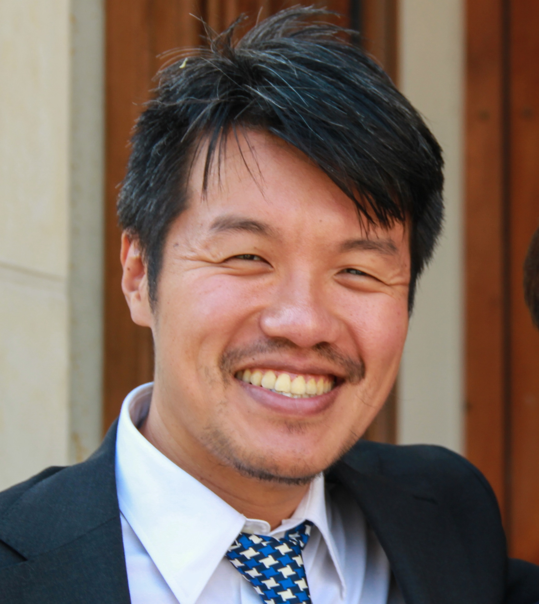

# Alexandre Quach

**AI-Augmented Preparator for Executives and Corporate Transversal Leaders** | Founder of [Komyu](https://www.komyu.fr) | Creating methods and agents for next-generation decision-making

---

## About

I specialize in **preparing executives and transversal leaders for the AI-augmented future**. I create methods and AI agents that transform corporate decision-making, helping organizations evolve into **human-AI superminds** capable of exponential collective intelligence.

### Core Focus
- **Executive AI Preparation**: Training leaders to orchestrate human-AI collaboration systems
- **Supermind Engineering**: Designing organizations where humans and AI agents work as unified intelligent systems
- **Agentic Decision Support**: Creating AI agents that augment executive decision-making processes
- **Transversal AI Leadership**: Developing cross-functional leaders capable of breaking silos through AI-enhanced methods

### My Unique Approach
**"The Executive Preparator Who Learns With Leaders"**

While others become executives, I prepare them. I continuously learn from world-class institutions (MIT AI Strategy, Stanford AI, Harvard Leadership) not to climb the corporate ladder, but to stay ahead of the AI transformation curve and equip tomorrow's leaders with cutting-edge human-AI collaboration methodologies.

---

## What I Do

### 🤖 **AI-Augmented Coaching**
- Design personalized AI agents that support executive decision-making
- Create hybrid human-AI coaching methodologies 
- Develop AI literacy programs for senior leadership

### 🧠 **Supermind Architecture**
- Engineer organizations that think and decide as unified human-AI systems
- Design collective intelligence frameworks enhanced by AI agents
- Create shared prompt engineering systems for collaborative problem-solving

### 🎯 **Executive AI Preparation**
- Train C-level executives to lead AI-augmented organizations
- Develop transversal leaders capable of orchestrating cross-functional AI adoption
- Create AI governance frameworks for executive teams

### 🔗 **Silo-Breaking Through AI**
- Use AI agents to facilitate cross-departmental collaboration
- Design AI-powered diagnostic tools for organizational transformation
- Create agentic systems that bridge communication gaps between functions

---

## Professional Journey

**Current**: Founder of Komyu, pioneering the next generation of AI-augmented collective intelligence

**Background**: 
- 15 years engineering human systems in large enterprises (Thales, BNP Paribas, GRDF, Amadeus)
- Executive education from MIT, Stanford, Harvard, Berkeley
- Developer of the ECC Method enhanced with AI agents
- Pioneer in collective prompt engineering and shared agent architectures
- 20+ certifications in AI, leadership, and organizational transformation

**Philosophy**: 
- **"AI augments humans, it doesn't replace them"** - I design the orchestration
- **Continuous AI Learning**: 8 hours/week staying ahead of AI developments
- **East-West Integration**: Combining AI precision with philosophical wisdom (Stoicism, Taoism)

---

## Explore

- **[Profile]({{ '/profile/' | relative_url }})**: Professional background and certifications
- **[Frameworks]({{ '/frameworks/' | relative_url }})**: ECC Method, Supermind Engineering, Agentic Decision Support
- **[Insights]({{ '/insights/' | relative_url }})**: Transformation insights and next-generation leadership concepts

---

## Ready to Engineer Your AI-Augmented Future?

The future belongs to leaders who can orchestrate human-AI superminds. Let's prepare your organization for exponential collective intelligence through next-generation decision-making systems.

**Contact**: alexandre.quach@komyu.fr